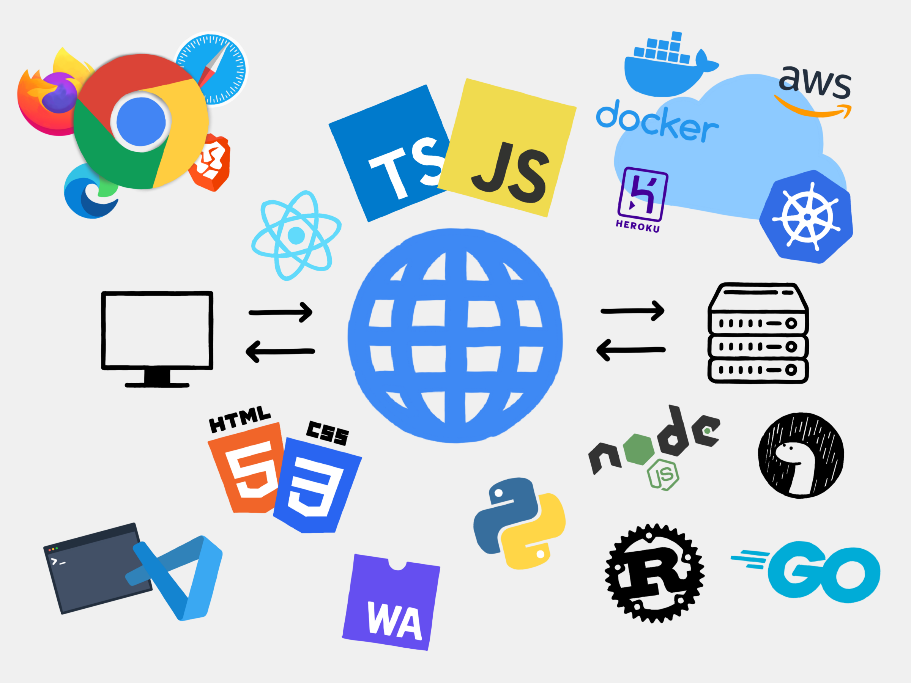
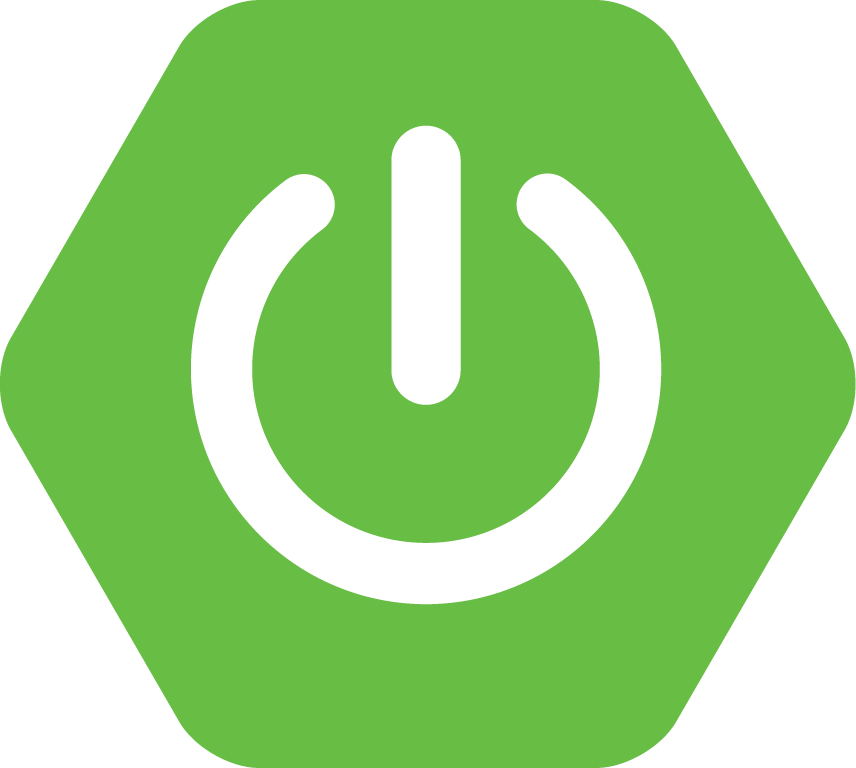
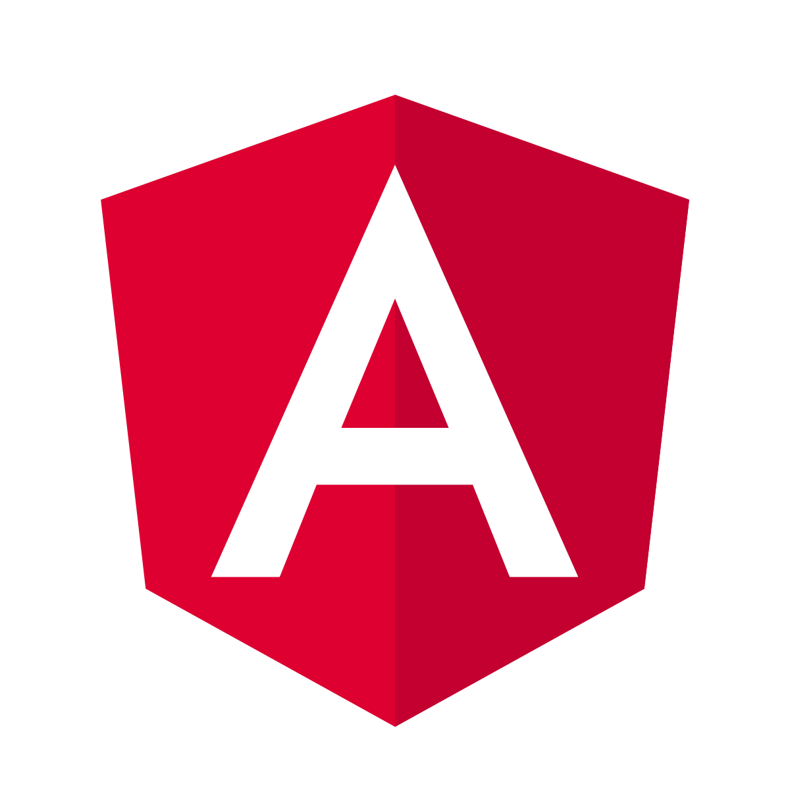
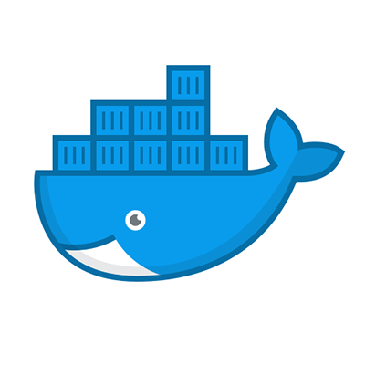
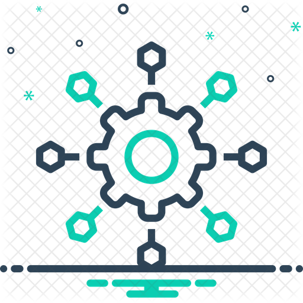

# Hi There , [How's it?](https://tarun-verma-c1cd3.web.app) 👋

## Software Professional & Code Enthusiast  

- 💬 I want to talk and learn about latest technologies anytime.
- 🧑‍💻 Currently working with an IT company.
- ⛳ I’m looking to collaborate with open source projects.
 

---
 

<table>
  <tr>
    <td></td>
    <td></td>
    <td></td>
  </tr>
</table>
  
---

### Connect with me:

 
 

---

### Languages and Tools:

 
